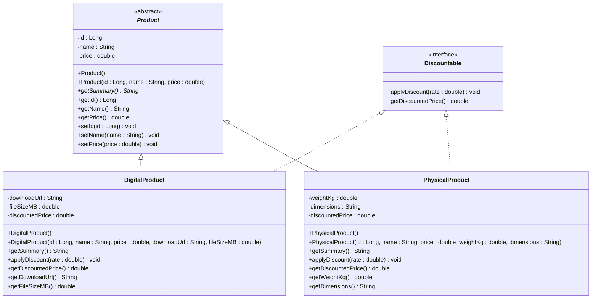

```mermaid
classDiagram
    class Product["*Product*"] {
        <<abstract>>
        -id : Long
        -name : String
        -price : double
        +Product()
        +Product(id : Long, name : String, price : double)
        +getSummary()* String
        +getId() Long
        +getName() String
        +getPrice() double
        +setId(id : Long) void
        +setName(name : String) void
        +setPrice(price : double) void
    }
    class Discountable {
        <<interface>>
        +applyDiscount(rate : double) void
        +getDiscountedPrice() double
    }
    class DigitalProduct {
        -downloadUrl : String
        -fileSizeMB : double
        -discountedPrice : double
        +DigitalProduct()
        +DigitalProduct(id : Long, name : String, price : double, downloadUrl : String, fileSizeMB : double)
        +getSummary() String
        +applyDiscount(rate : double) void
        +getDiscountedPrice() double
        +getDownloadUrl() String
        +getFileSizeMB() double
    }
    class PhysicalProduct {
        -weightKg : double
        -dimensions : String
        -discountedPrice : double
        +PhysicalProduct()
        +PhysicalProduct(id : Long, name : String, price : double, weightKg : double, dimensions : String)
        +getSummary() String
        +applyDiscount(rate : double) void
        +getDiscountedPrice() double
        +getWeightKg() double
        +getDimensions() String
    }
    Product <|-- DigitalProduct
    Product <|-- PhysicalProduct
    Discountable <|.. DigitalProduct
    Discountable <|.. PhysicalProduct
```
